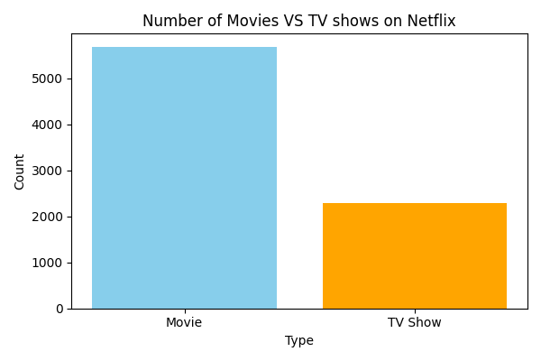
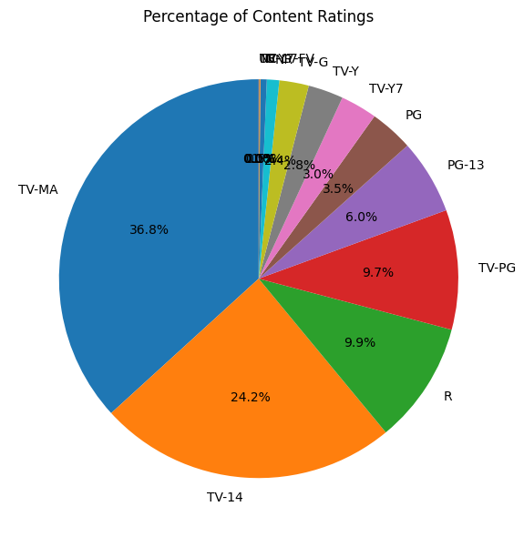
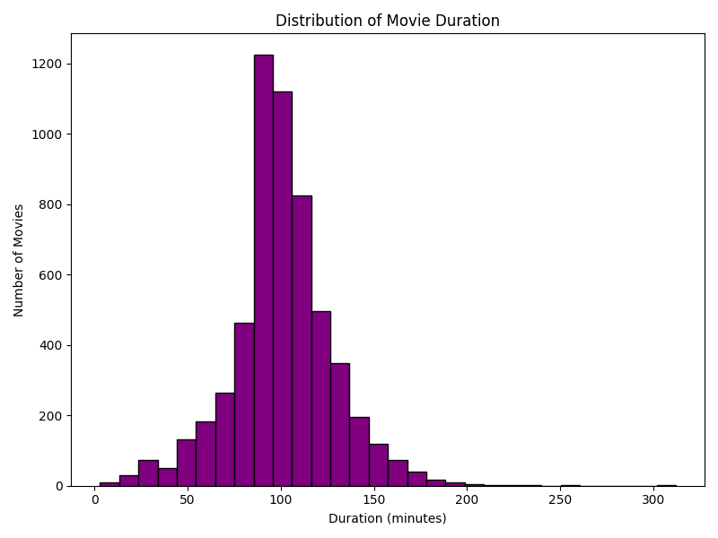
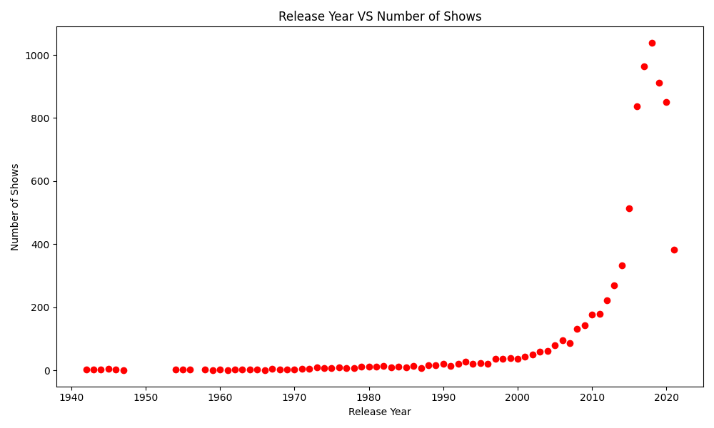
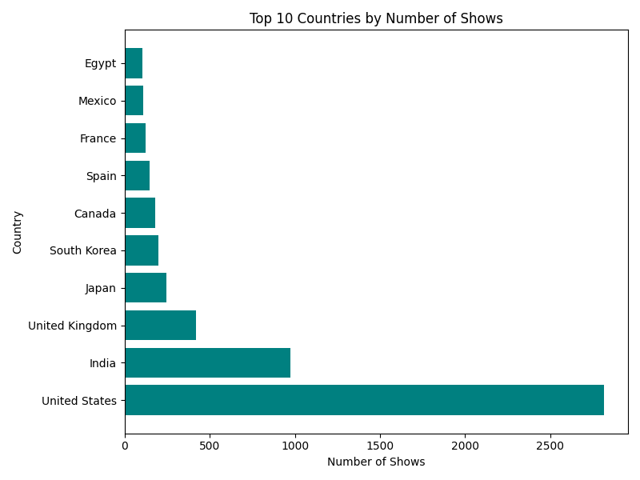

# Netflix-Data-Analysis
A comprehensive Exploratory Data Analysis (EDA) project on the Netflix Movies & TV Shows dataset (8,807 records * 12 features) using Python, Pandas, NumPy, and Matplotlib in Google Colab. The project focuses on data preprocessing, visualization, and extracting actionable insights from real-world streaming data.

## Libraries Used
- Python
- Pandas
- NumPy
- Matplotlib

## Analysis Performed
- Missing value handling
- Data preprocessing
- Genre analysis
- Rating distribution
- Country-wise analysis
- Year-wise analysis
- Movie vs TV Show comparison

## Sample Visualization

### Movies vs TV Shows

### Percentage of Content Ratings

### Movies Duration Histogram

### Release Year Scatter

### Top 10 Countries

## Conclusion
This project demonstrates the application of Python-based Exploratory Data Analysis (EDA) techniques to extract meaningful insights from a real-world dataset. Through data preprocessing, visualization, and trend analysis, the project highlights the importance of data-driven decision-making while strengthening practical skills in Python, Pandas, NumPy, and Matplotlib.

Future enhancements may include interactive dashboards, advanced statistical analysis, and machine learning models to further expand the analytical capabilities of the project.

